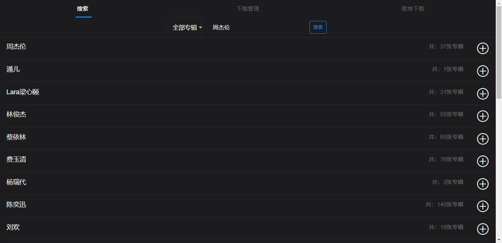
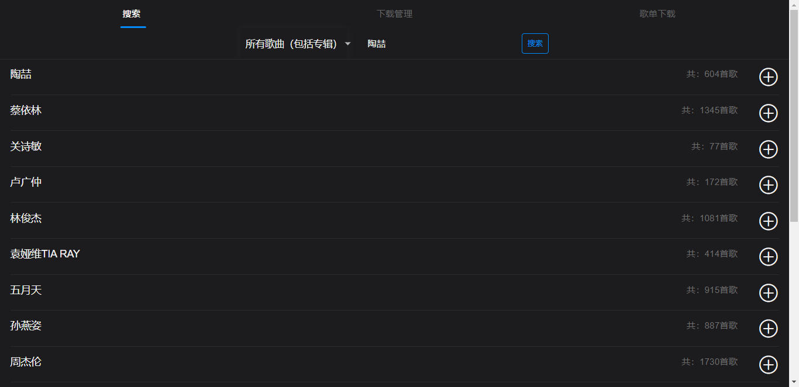
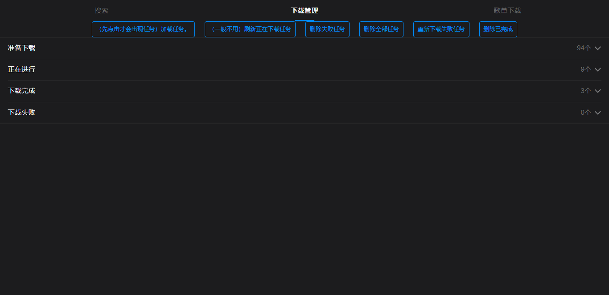
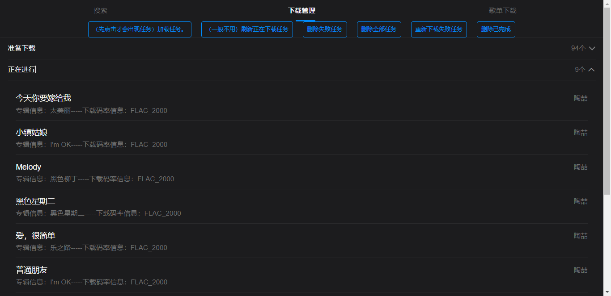
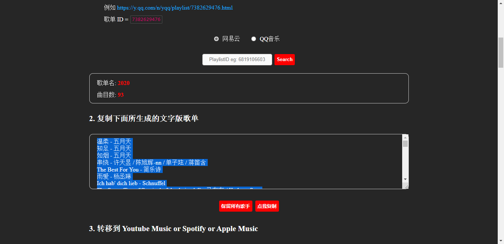
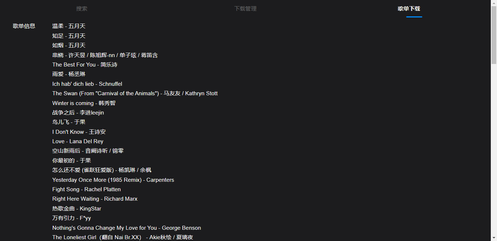
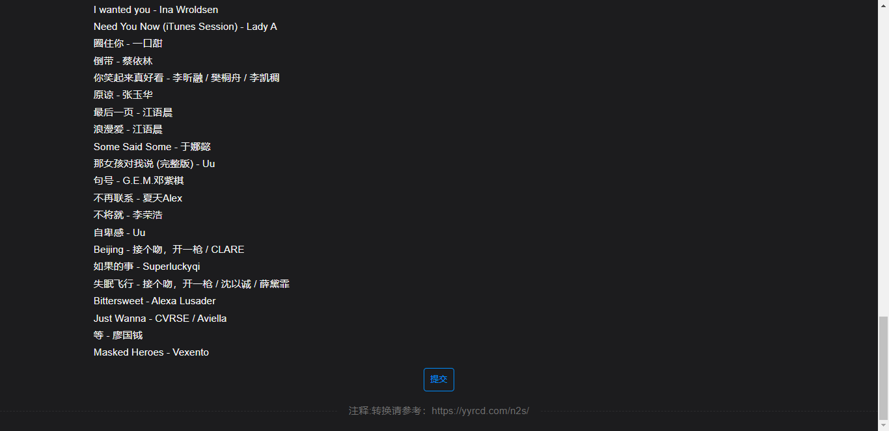
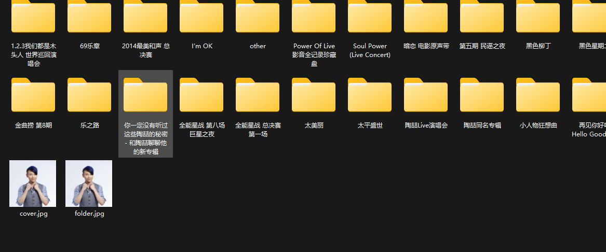

## 项目描述

下载音乐工具，可以当普通的音乐下载工具使用，支持，flac，ape，mp3等格式的下载（根据码率不同）， 下载的歌曲目录结构支持emby 与 subsonic 类的服务，下载文件支持文件标签识别，歌词下载。

\Music \Artist Name \Album Name 1- Song.mp3 2- Song.mp3

emby识别请参考如下配置
https://support.emby.media/support/solutions/articles/44001159113-music-naming

## 整体配置

1. 登录用户名密码在 db文件中修改 （默认账号 admin 密码 admin）
2. 文件下载路径 db文件中修改 ---> musicPath
3. 其余配置 application-music.yml 请自行查看根据情况修改
4. 缓存 ehcache.xml--->diskStore
5. 日志 logback.xml---->property--->log.path

自己打包java 运行 更方便 
咱最新的桌面播放器 也支持此服务 双击右下方版本号可进入插件设置使用此服务

播放器：
https://github.com/59799517/sq_subsonic_desktop

## 使用可（java -jar ./simple-MusicServer-0.0.1-SNAPSHOT.jar

1. 安装java17
2. 运行jar包即）

## 打包docker方法

1. 删除旧的包 docker rmi sqmusicplusserver
2. 打包新的 docker build -t sqmusicplusserver .
3. 运行 docker run -d --name="sqmusicplusserver"   -p 8022:8083 -v /mnt/user/media/newmusic:/music -v
   /mnt/user/appdata/sqmusic:/config sqmusicplusserver

### 运行图：

