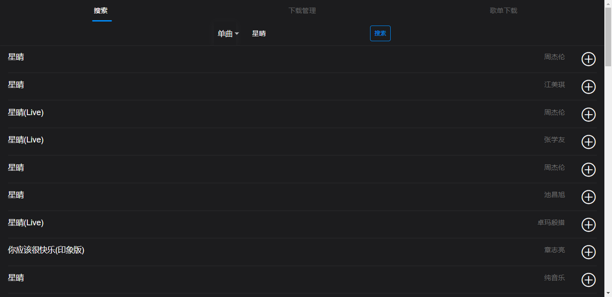

## 有什么功能需要可以issues 有必要的我会加上去

### 弄个2.0版本的增加咪咕的API QQ的待定（QQ音乐得充钱-将白嫖进行到底）
## 项目描述

存在问题
获取下载任务当前部分信息报错（部分类不支持序列化）
获取下载任务类数据和之前格式不同（可能会修改前端）

已完成：
修复部分情况下载需要好几次才能下载问题（重写下载器为任务调度）
修复酷我flac下载失效问题
前端UI重绘（使用flutter）

下载音乐工具，可以当普通的音乐下载工具使用，支持，flac，ape，mp3等格式的下载（根据码率不同）， 下载的歌曲目录结构支持emby 与 subsonic 类的服务，下载文件支持文件标签识别，歌词下载。

\Music \Artist Name \Album Name 1- Song.mp3 2- Song.mp3

emby识别请参考如下配置
https://support.emby.media/support/solutions/articles/44001159113-music-naming

## 整体配置

1. 登录用户名密码在 application-music.yml -----> user 修改 （默认账号 admin 密码 admin）
2. 文件下载路径 application-music.yml ---> musicPath
3. 其余配置 application-music.yml 请自行查看根据情况修改
4. 缓存 ehcache.xml--->diskStore
5. 日志 logback.xml---->property--->log.path

## 使用可（java -jar ./simple-MusicServer-0.0.1-SNAPSHOT.jar

1. 安装java17
2. 运行jar包即）

## 打包docker方法

1. 删除旧的包 docker rmi sqmusicplusserver
2. 打包新的 docker build -t sqmusicplusserver .
3. 运行 docker run -d --name="sqmusicplusserver"   -p 8022:8083 -v /mnt/user/media/newmusic:/music -v
   /mnt/user/appdata/sqmusic:/config sqmusicplusserver

### 运行图：

后期可能实现功能

